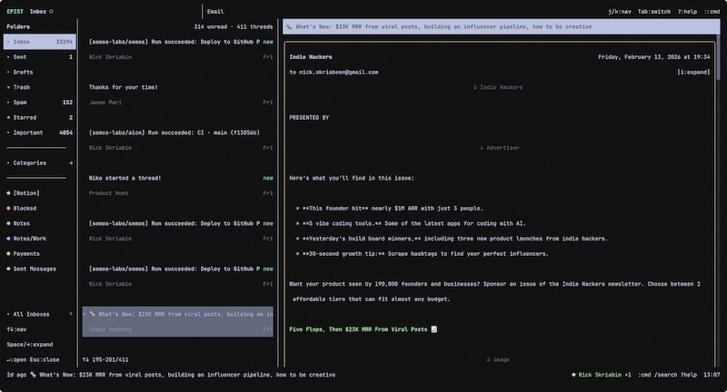

<p align="center">
  
</p>

<h1 align="center">Epist</h1>

<p align="center">
  <strong>Terminal email client with vim-style keybindings</strong><br>
  <em>Beautiful. Fast. Keyboard-driven. Gmail + IMAP/SMTP.</em>
</p>

<p align="center">
  
</p>

<p align="center">
  <a href="#quick-start">Quick Start</a> •
  <a href="#keybindings">Keybindings</a> •
  <a href="#commands">Commands</a> •
  <a href="#configuration">Configuration</a>
</p>

<p align="center">
  <a href="https://github.com/nick-skriabin/epist/releases/latest"></a>
  <a href="https://github.com/nick-skriabin/epist/releases/latest"></a>
  
  
  <a href="https://github.com/semos-labs/glyph"></a>
</p>

---

## Table of Contents

- [Why Epist?](#why-epist)
- [How Epist Compares](#how-epist-compares)
- [Quick Start](#quick-start)
- [Keybindings](#keybindings)
  - [Email List](#email-list)
  - [Email View](#email-view)
  - [Compose / Reply](#compose--reply)
  - [Folders & Labels](#folders--labels)
  - [General](#general)
- [Commands](#commands)
- [Configuration](#configuration)
- [Data Storage](#data-storage)
- [Tech Stack](#tech-stack)
- [Roadmap](#roadmap)

---

## Why Epist?

Most email clients are mouse-driven, bloated, and slow. Epist takes a different approach:

**Vim-style navigation. Terminal-native. Zero distractions.**

### Features

| Feature | Description |
|---------|-------------|
| **⌨️ Vim Keybindings** | Navigate with `j`/`k`, `gg`/`G`, `h`/`l` — feels like home |
| **📬 Two-Column Layout** | Email list on the left, full view on the right |
| **🔗 Gmail + IMAP/SMTP** | Gmail OAuth with PKCE **and** generic IMAP/SMTP — use any email provider |
| **🔐 Secure Credentials** | Passwords via `password_command` — works with Keychain, `pass`, 1Password CLI, Bitwarden, env vars |
| **🧵 Thread View** | Conversation threads with `[`/`]` to navigate between messages |
| **📂 Labels & Folders** | Gmail labels with colored dots, IMAP folders mapped automatically |
| **📁 Categories** | Collapsible Gmail categories (Social, Promotions, Updates, Forums) |
| **🔍 Two-Step Search** | Instant local filtering + remote search with debouncing |
| **📎 Attachments** | View, save, and open attachments — bulk save with `S` |
| **📅 Calendar Invites** | Auto-parse inline and `.ics` calendar invites with RSVP support |
| **✏️ Compose & Reply** | Full compose, reply, reply-all, forward, and quick inline reply |
| **👥 Contact Autocomplete** | Tab/↑/↓/Enter to navigate suggestions from your email history |
| **⭐ Bulk Actions** | Select multiple threads with `x`, then archive, delete, or move |
| **↩️ Undo** | Undo the last action with `z` within a configurable timeout |
| **📝 Command Palette** | Quick access to all actions with `:` |
| **❓ Context Help** | Press `?` anywhere to see available keybindings |
| **💾 Local-First** | SQLite cache — your data stays yours, instant startup |
| **🎨 Themeable** | Customize colors via TOML configuration |
| **🚀 Fast** | Built with Bun and React — instant startup |

---

## How Epist Compares

There are many great terminal email clients out there. Here's how Epist stacks up against the most popular ones:

| Feature | Epist | [NeoMutt](https://neomutt.org) | [aerc](https://aerc-mail.org) | [Himalaya](https://github.com/pimalaya/himalaya) | [Alpine](https://alpineapp.email) | [meli](https://meli-email.org) |
|---------|:-----:|:-------:|:----:|:--------:|:------:|:----:|
| **Protocol** | Gmail API + IMAP/SMTP | IMAP/POP3/SMTP | IMAP/SMTP/Notmuch | IMAP/SMTP | IMAP/POP3/SMTP | IMAP/Notmuch/Maildir |
| **Gmail OAuth (built-in)** | ✅ | ❌¹ | ⚠️² | ⚠️² | ❌ | ❌ |
| **IMAP/SMTP support** | ✅ Any provider | ✅ | ✅ | ✅ | ✅ | ✅ |
| **Setup complexity** | `brew install` + `:login` | Extensive `.muttrc` config | Moderate config files | Moderate config | Menu-driven setup | TOML config |
| **Secure credentials** | ✅ `password_command` | ✅ | ✅ | ✅ | ❌ | ✅ |
| **Vim keybindings** | ✅ Out of the box | ✅ Customizable | ✅ Inspired | ❌ CLI only | ❌ Menu-driven | ⚠️ Partial |
| **Two-column layout** | ✅ List + preview | ❌ Single pane | ❌ Single pane | ❌ CLI only | ❌ Single pane | ✅ |
| **Thread view** | ✅ Navigate with `[`/`]` | ✅ | ✅ | ⚠️ Basic | ✅ | ✅ |
| **Multi-account** | ✅ Mix Gmail + IMAP | ✅ Complex config | ✅ | ✅ | ✅ | ✅ |
| **Calendar invites (ICS)** | ✅ Parse + RSVP | ❌ | ⚠️ View only | ❌ | ❌ | ❌ |
| **Contact autocomplete** | ✅ From history | ✅ With aliases | ✅ | ❌ | ✅ | ❌ |
| **Local cache / offline** | ✅ SQLite | ⚠️ Header cache | ❌ | ❌ | ❌ | ⚠️ Maildir |
| **Search** | ✅ Local + remote | ✅ With notmuch | ✅ | ✅ Basic | ✅ | ✅ With notmuch |
| **Gmail labels & categories** | ✅ Colored dots | ⚠️ Via IMAP folders | ⚠️ Via IMAP folders | ⚠️ Via IMAP folders | ⚠️ Via IMAP folders | ⚠️ Via IMAP folders |
| **Undo actions** | ✅ | ❌ | ❌ | ❌ | ❌ | ❌ |
| **Command palette** | ✅ Fuzzy matching | ❌ | ✅ | ❌ | ❌ | ❌ |
| **Inline quick reply** | ✅ | ❌ | ❌ | ❌ | ❌ | ❌ |
| **Context-aware help** | ✅ Press `?` anywhere | ✅ | ❌ | ❌ | ✅ | ❌ |
| **Bulk actions** | ✅ Select + act | ✅ Tag patterns | ✅ | ❌ | ✅ | ✅ |
| **Themeable** | ✅ TOML config | ✅ `.muttrc` | ✅ `stylesets` | ❌ | ✅ Limited | ✅ Themes |
| **Written in** | TypeScript (Bun) | C | Go | Rust | C | Rust |

<sup>¹ Requires external helper scripts (e.g. `oauth2.py`) or app-specific passwords</sup><br>
<sup>² Supports OAuth via external credential commands, requires manual setup</sup>

> **TL;DR** — Epist is built for people who want a **modern, keyboard-driven** terminal email experience with **zero friction**. Gmail users get one-command OAuth setup. IMAP/SMTP users get secure `password_command` integration with any secret manager. Mix both in a single client.

---

## Quick Start

### Option 1: Homebrew (macOS/Linux)

```bash
brew tap semos-labs/tap
brew install epist
```

### Option 2: Build from Source

```bash
git clone https://github.com/nick-skriabin/epist.git
cd epist
bun install

# Run in development
bun dev

# Or run directly
bun start
```

### Set Up Email — Choose Your Provider

Epist supports **Gmail (OAuth)** and **IMAP/SMTP** (any email provider). You can use both simultaneously.

---

### Option A: IMAP/SMTP (Any Provider)

Add your account directly to `~/.config/epist/config.toml`:

```toml
[[accounts]]
name = "Work"
email = "me@work.com"
provider = "imap"

[accounts.imap]
host = "imap.work.com"
port = 993
security = "tls"
username = "me@work.com"
password_command = "security find-generic-password -a me@work.com -s epist -w"

[accounts.smtp]
host = "smtp.work.com"
port = 587
security = "starttls"
username = "me@work.com"
password_command = "security find-generic-password -a me@work.com -s epist -w"
```

**Password options** (pick one):

| Method | Example |
|--------|---------|
| macOS Keychain | `password_command = "security find-generic-password -a me@work.com -s epist -w"` |
| `pass` (GPG) | `password_command = "pass show email/work"` |
| 1Password CLI | `password_command = "op read op://Personal/WorkEmail/password"` |
| Bitwarden CLI | `password_command = "bw get password work-email"` |
| Environment var | `password_command = "echo $WORK_EMAIL_PASSWORD"` |
| Plain text | `password = "hunter2"` *(not recommended)* |

You can add multiple `[[accounts]]` blocks for multiple IMAP/SMTP accounts.

---

### Option B: Gmail (OAuth)

Epist requires Google Cloud credentials to access Gmail. Here's how to set them up:

#### Create a Google Cloud Project

1. Go to [Google Cloud Console](https://console.cloud.google.com)
2. Create a new project (or select an existing one)
3. Enable the **Gmail API**:
   - Go to "APIs & Services" → "Library"
   - Search for "Gmail API" and click "Enable"
   - Also enable "Google Calendar API" and "People API" (for contacts)

#### Create OAuth Credentials

1. Go to "APIs & Services" → "Credentials"
2. Click "Create Credentials" → "OAuth client ID"
3. If prompted, configure the OAuth consent screen:
   - User Type: **External** (or Internal for Workspace)
   - Add your email as a test user
   - Add the following scopes:
     - `gmail.modify` (read/write mail and labels)
     - `gmail.send` (send mail)
     - `calendar.events` (read/write calendar events)
     - `calendar.readonly` (read calendars list)
     - `contacts.readonly` (read contacts)
     - `userinfo.email` and `userinfo.profile` (get user info)
4. Create OAuth client ID:
   - Application type: **Desktop app**
   - Name: "Epist" (or anything you like)
5. Copy the **Client ID** and **Client Secret**

#### Configure Epist

Add your credentials to `~/.config/epist/config.toml`:

```toml
[google]
clientId = "your-client-id.apps.googleusercontent.com"
clientSecret = "your-client-secret"
```

Or use environment variables:

```bash
export EPIST_GOOGLE_CLIENT_ID="your-client-id.apps.googleusercontent.com"
export EPIST_GOOGLE_CLIENT_SECRET="your-client-secret"
```

### Connect Gmail

```
:login
```

Follow the OAuth flow in your browser. Epist supports multiple Google accounts — IMAP accounts are loaded automatically from `config.toml`.

### Navigate

Use `j`/`k` to move through emails, `Tab` to switch panes, `Enter` to open.

---

## Keybindings

### Email List

| Key | Action |
|-----|--------|
| `j` / `↓` | Next email |
| `k` / `↑` | Previous email |
| `gg` | First email |
| `G` | Last email |
| `Enter` / `Space` | Open email |
| `l` / `→` | View email |
| `Tab` / `` ` `` | Switch to view pane |
| `s` | Toggle star |
| `e` | Archive |
| `D` | Delete |
| `u` | Toggle read/unread |
| `r` | Reply |
| `R` | Reply all |
| `f` | Forward |
| `c` | Compose new |
| `m` | Move to folder |
| `x` | Toggle thread selection |
| `A` | Select all threads |
| `z` | Undo last action |
| `/` | Search emails |
| `:` | Open command bar |
| `?` | Show help |

### Email View

| Key | Action |
|-----|--------|
| `j` / `↓` | Scroll down |
| `k` / `↑` | Scroll up |
| `Ctrl+d` | Page down |
| `Ctrl+u` | Page up |
| `gg` | Scroll to top |
| `G` | Scroll to bottom |
| `h` / `←` / `Esc` | Back to list |
| `]` | Next message in thread |
| `[` | Previous message in thread |
| `Tab` | Next link |
| `Shift+Tab` | Previous link |
| `Enter` | Open link |
| `Q` | Quick inline reply |
| `i` | Toggle headers |
| `I` | Toggle image navigation |
| `a` | Toggle attachments |
| `s` | Toggle star |
| `e` | Archive |
| `D` | Delete |
| `r` | Reply |
| `R` | Reply all |
| `f` | Forward |
| `m` | Move to folder |
| `z` | Undo |

#### Calendar Invite RSVP

| Key | Action |
|-----|--------|
| `y` | Accept invite |
| `n` | Decline invite |
| `t` | Maybe / Tentative |

#### Attachment Navigation

| Key | Action |
|-----|--------|
| `j` / `k` | Navigate attachments |
| `Enter` / `o` | Open attachment |
| `s` | Save attachment |
| `S` | Save all attachments |

### Compose / Reply

| Key | Action |
|-----|--------|
| `Ctrl+s` | Send email |
| `Ctrl+f` | Toggle fullscreen |
| `Ctrl+b` | Toggle Cc/Bcc fields |
| `Ctrl+a` | Attach file |
| `Ctrl+g` | Manage attachments |
| `Esc` | Cancel |

### Inline Reply

| Key | Action |
|-----|--------|
| `Ctrl+s` | Send reply |
| `Ctrl+f` | Expand to full reply |
| `Esc` | Cancel |

### Folders & Labels

| Key | Action |
|-----|--------|
| `Ctrl+f` | Toggle folder sidebar |
| `j` / `k` | Navigate folders |
| `Space` / `→` | Toggle categories section |
| `←` | Collapse categories |
| `Esc` | Close sidebar |

### General

| Key | Action |
|-----|--------|
| `q` | Quit |
| `Ctrl+c` | Quit |
| `Ctrl+f` | Toggle folder sidebar |
| `:` | Open command palette |
| `/` | Search emails |
| `?` | Show help (context-aware) |

---

## Commands

Open the command palette with `:` and type a command:

### Email Management

| Command | Action |
|---------|--------|
| `archive` | Archive current email |
| `delete` | Delete current email |
| `star` | Toggle star |
| `unread` | Toggle read/unread |
| `move` | Move to folder |
| `undo` | Undo last action |

### Compose

| Command | Action |
|---------|--------|
| `compose` | Compose new email |
| `reply` | Reply to current email |
| `reply-all` | Reply all |
| `forward` | Forward current email |

### Navigation

| Command | Action |
|---------|--------|
| `search` | Search emails |

### Accounts

| Command | Action |
|---------|--------|
| `login` | Add Google account (OAuth) |
| `logout` | Remove all accounts |
| `profile` | Manage connected accounts (Gmail + IMAP) |
| `sync` | Force sync with server |
| `reset-sync` | Clear cache & full resync |

### General

| Command | Action |
|---------|--------|
| `help` | Show keybindings |
| `quit` | Exit application |

---

## Configuration

Create or edit `~/.config/epist/config.toml` to customize Epist:

```toml
# Epist — Terminal Email Client Configuration

# ===== General Settings =====
[general]
downloads_path = "~/Downloads"
auto_mark_read = true
auto_save_interval = 5  # seconds
undo_timeout = 5  # seconds

# ===== Email Signature =====
[signature]
enabled = true
text = """
--
Sent from Epist
"""

# ===== Theme =====
# Colors: black, red, green, yellow, blue, magenta, cyan, white, blackBright, etc.
[theme]
accent_color = "cyan"
header_bg = "white"
selected_bg = "blackBright"
starred_color = "yellow"
unread_style = "bold"  # bold, color, or both

# ===== Google OAuth =====
# Get credentials from https://console.cloud.google.com
[google]
clientId = ""
clientSecret = ""

# ===== Keybind Overrides =====
# Override default keybinds. Format: action = "key"
# Example: archive = "a"
[keybinds]

# ===== Accounts =====
# Supported providers: "gmail" (OAuth) and "imap" (IMAP/SMTP)
# Per-account signature overrides the global signature
# You can mix Gmail and IMAP accounts freely

# Gmail account (uses OAuth — run :login to authenticate)
[[accounts]]
name = "Personal"
email = "me@example.com"
provider = "gmail"
is_default = true

# IMAP/SMTP account (any email provider)
[[accounts]]
name = "Work"
email = "me@work.com"
provider = "imap"
signature = "--\nSent from my work account"

[accounts.imap]
host = "imap.work.com"
port = 993
security = "tls"           # "tls" (993), "starttls" (143), or "none"
username = "me@work.com"
password_command = "pass show email/work"

[accounts.smtp]
host = "smtp.work.com"
port = 587
security = "starttls"      # "tls" (465), "starttls" (587), or "none"
username = "me@work.com"
password_command = "pass show email/work"
```

---

## Data Storage

Epist follows the [XDG Base Directory Specification](https://specifications.freedesktop.org/basedir-spec/basedir-spec-latest.html):

**Configuration** (`~/.config/epist/`):

| File | Description |
|------|-------------|
| `config.toml` | User configuration (accounts, credentials, theme, keybinds) |

**Data** (`~/.local/share/epist/`):

| File | Description |
|------|-------------|
| `epist.db` | SQLite database (emails, labels, sync state) |
| `accounts.json` | OAuth tokens and account info |
| `account-settings.json` | Custom account display names |
| `drafts/` | Saved email drafts |
| `logs/` | Application logs |

You can override XDG paths with environment variables:
- `XDG_CONFIG_HOME` (default: `~/.config`)
- `XDG_DATA_HOME` (default: `~/.local/share`)

---

## Tech Stack

| Component | Technology |
|-----------|------------|
| **Runtime** | [Bun](https://bun.sh) |
| **UI Framework** | [Glyph](https://github.com/semos-labs/glyph) (React for terminals) |
| **State Management** | [Jotai](https://jotai.org) |
| **Database** | SQLite via [Drizzle ORM](https://orm.drizzle.team) |
| **IMAP** | [ImapFlow](https://imapflow.com) |
| **SMTP** | [Nodemailer](https://nodemailer.com) |
| **MIME Parsing** | [Mailparser](https://nodemailer.com/extras/mailparser/) |
| **Date/Time** | [Luxon](https://moment.github.io/luxon) |
| **NLP Dates** | [chrono-node](https://github.com/wanasit/chrono) |
| **HTML Rendering** | [Cheerio](https://cheerio.js.org) + [Turndown](https://github.com/mixmark-io/turndown) + [Marked](https://marked.js.org) |
| **Validation** | [Zod](https://zod.dev) |

---

## Roadmap

### ✅ Completed

- [x] Gmail sync via OAuth with PKCE
- [x] IMAP/SMTP support (any email provider)
- [x] Secure credentials via `password_command`
- [x] Multi-account support (mix Gmail + IMAP)
- [x] Two-column layout (list + view)
- [x] Thread view with message navigation
- [x] Compose, reply, reply-all, forward
- [x] Quick inline reply
- [x] Contact autocomplete from email history
- [x] Dynamic Gmail labels & folders with colored dots
- [x] IMAP folder auto-discovery (special-use flags + name heuristics)
- [x] Collapsible Gmail categories
- [x] Two-step search (local + remote)
- [x] Attachment view, save, and open
- [x] Calendar invite parsing (inline + `.ics` attachments)
- [x] Calendar invite RSVP
- [x] Bulk selection & actions
- [x] Undo support
- [x] Move to folder picker
- [x] Star, archive, delete, mark read/unread
- [x] Command palette with fuzzy matching
- [x] Context-aware help dialog
- [x] Local SQLite cache with instant startup
- [x] Background sync (10s interval)
- [x] Image navigation mode
- [x] Link navigation with Tab
- [x] Configurable theme & keybinds
- [x] XDG Base Directory support
- [x] Draft auto-save
- [x] Homebrew distribution

### 📋 Planned

- [ ] Downloadable binaries
- [ ] Offline mode improvements
- [ ] IMAP IDLE push notifications
- [ ] Email templates
- [ ] PGP/GPG encryption

---

## License

MIT © 2025

---

<p align="center">
  <sub>Built with ⌨️ for terminal lovers</sub>
</p>
